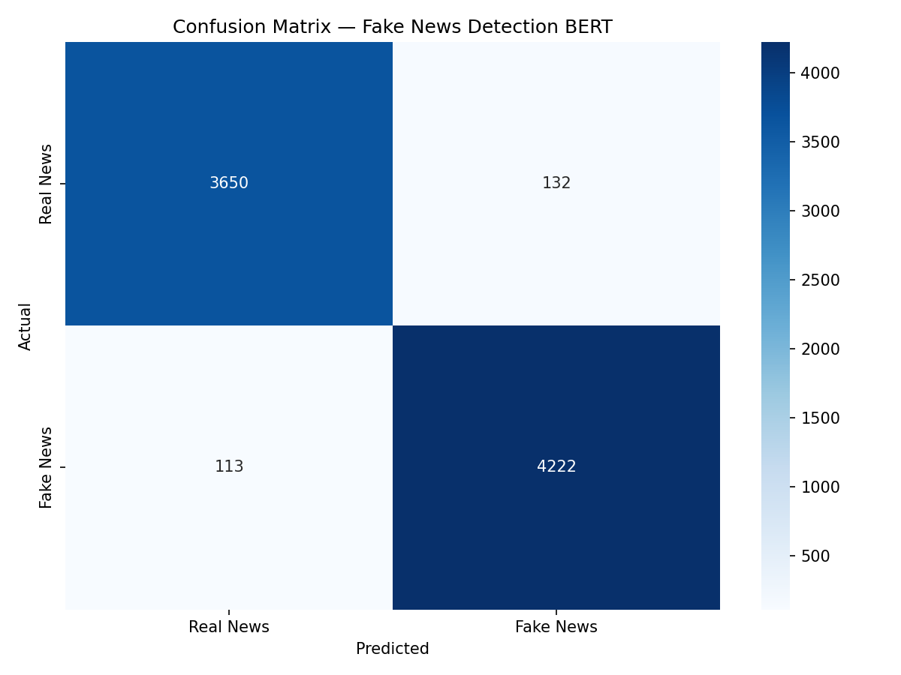

# Fake News Detection with Fine-tuned BERT

A deep learning NLP system that detects fake news articles using a fine-tuned BERT transformer model.

## Results

| Metric | Score |
|--------|-------|
| Accuracy | 97% |
| F1 Score | 0.9698 |
| Real News Precision | 0.97 |
| Fake News Precision | 0.97 |
| Training Loss (Epoch 1) | 0.1334 |
| Training Loss (Epoch 3) | 0.0259 |

## Model
- Base model: bert-base-uncased
- Fine-tuned on 24,353 news article titles
- 3 epochs, batch size 16, learning rate 2e-5
- Training time: ~16 minutes on Tesla T4 GPU

## Tech Stack
- PyTorch, Hugging Face Transformers
- BERT-base-uncased (fine-tuned)
- Datasets library, Scikit-learn
- Google Colab (Tesla T4 GPU)

## Confusion Matrix

